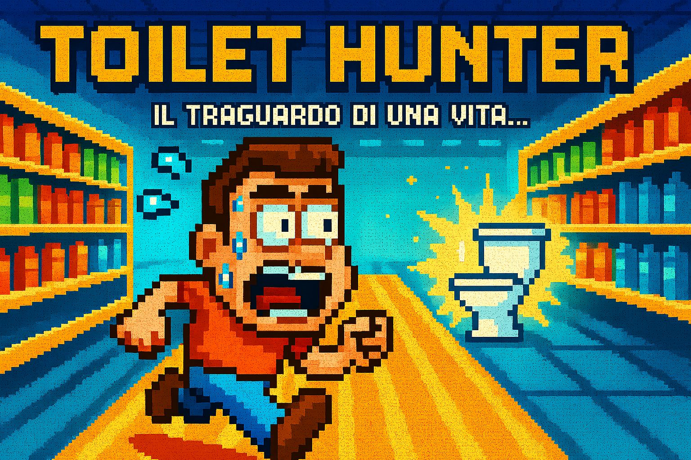

# 🚽 Toilet Hunter: The Last Dash

## Overview
**Toilet Hunter: The Last Dash** is a frantic, comedic action game where you must dash to the restroom before your bladder meter overflows! Dodge obstacles, manage your speed, and reach the toilet in under 60 seconds.

---

## How to Play

- **Move**: Use A/D or arrow keys to run left and right.
- **Jump**: Press Space or your jump key to leap over obstacles.
- **Dash**: Use the dash key (Shift or custom) for a burst of speed (with cooldown).
- **Goal**: Reach the toilet before your bladder fills up or time runs out!

---

## Core Mechanics

- **Bladder Meter**: Fills automatically over 60 seconds. If it reaches 100%, you lose!
- **Obstacles**: Bananas, shopping carts, and toddlers slow you down or knock you back.
- **Dash**: Temporarily increases your speed, but has a cooldown.
- **Win/Lose**: Reach the toilet to win. If your bladder meter fills or time runs out, you lose.

---

## Project Structure

- `Main.tscn`: Main game scene (world, player, camera, HUD, spawner).
- `Player.tscn` / `player.gd`: Player movement, dash, and animation logic.
- `HUD.tscn`: UI for bladder meter, timer, and messages.
- `Obstacle_*.tscn`: Banana, cart, granny, duck, etc. (each with their own script).
- `GameHandler.gd`: Manages bladder, win/lose state.
- `obstacles_generator.gd`: Spawns obstacles at random intervals/positions.
- `GameOver.tscn`: Retry/Quit interface.

---

## Assets

- Player sprites: walk, dash, panic
- Obstacles: banana peel, shopping cart, toddler, granny, duck
- Background tileset
- Toilet goal sprite
- UI: progress bar, fonts, buttons
- SFX: slipping, panic, toilet flush, dash

---

## Credits

Game design inspired by classic runner games and jammed together for fun!  

---

## LET'S GOOOO 🚽💨